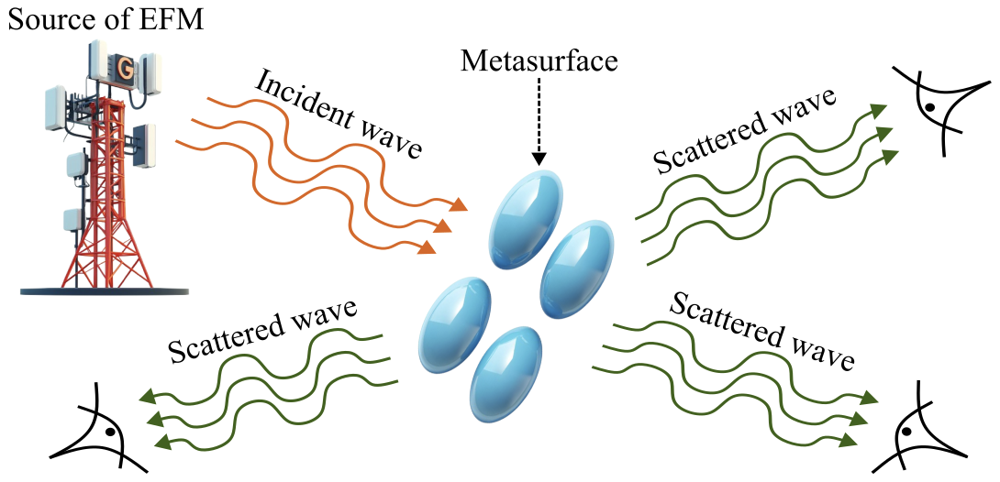

# Diffusion Model for Electromagnetic Inverse Design Problem

This repository contains implementations of both **conditional** diffusion models for 1D data generation, built with PyTorch. The models are designed to solve inverse design scattering problems. The outputs of the models are vectors with relative values which can then be decoded to generate the geometry of metamaterials made of dielectric spheres. The project also includes comprehensive parametrization tools and CMA-ES optimization capabilities for geometry optimization based on target spectra to compare geometry results.



## Installation
- In VS Code install the "Remote Development" extension pack
- Open your project folder in VS Code and Press F1 (or Cmd/Ctrl+Shift+P) 
- Select "Dev Containers: Reopen in Container", then VS Code will: 
  1) Build the Docker container 
  2) Connect to it 
  3) Set up the Python environment 
  4) Configure debugging 
- Mount your local project directory into the container
- Install all required packages using [requirements.txt](requirements.txt)

## Diffusion model

### [Tutorial: Conditional Diffusion Model](diffusion_model_inference_example.ipynb)

Tutorial that presents a work process with conditional diffusion model can be found in the repository. 

### Conditional Diffusion Model

The conditional model generates 1D sequences based on conditional vectors (DSCS values on specified angles):

```python
from diffusion_model.conditional_network.conditional_model import Diffusion_model
import torch

# Initialize the conditional model
model = Diffusion_model(
    milestone=38,
    use_film=True,
    cond_dim=10,
    train_batch_size=16,
    train_lr=4e-4,
    train_num_steps=20000,
    gradient_accumulate_every=2,
    ema_decay=0.995,
    timesteps=1000,
    amp=True,
    angles=[0, 10, 20, 40, 60, 80, 100, 120, 140, 160]
)

# Train the model
model.__train__()

# Generate conditional samples
conditional_vec = torch.randn(1, 10)  # 10-dimensional condition vector
sampled_seq = model.__sample__(batch_size=1, conditional_vec=conditional_vec)

# Use DDIM sampling for faster generation
sampled_seq_ddim = model.__sample_ddim__(
    shape=(1, 1, 16), 
    conditional_vec=conditional_vec
)

```

## Metasurface Parametrization

The project includes a comprehensive framework for parametrizing and optimizing dielectric sphere-based metasurfaces. This allows you to convert the output vectors from diffusion models into actual physical geometries.

### Sphere Surface Parametrization

The `Sphere_surface` class provides a flexible way to create metasurfaces:

```python
from sphere_metasurface.parametrization import Sphere_surface

# Create a metasurface with 4x4 grid of cells
surface = Sphere_surface(
    number_of_cells=4,
    side_length=4.0,
    reflective_index=complex(2.0, 0.0)  # refractive index
)

# Generate the mesh
surface.mesh_generation()

# Add spheres with specific radii and positions
radii = [0.2, 0.3, 0.25, 0.35, ...]  # 16 values for 4x4 grid
positions = [[0.5, 0.5, 0], [1.5, 0.5, 0], ...]  # 16 positions

surface.__spheres_add__(radii, positions)

# Visualize the metasurface
surface.spheres_plot("metasurface.png")
```

## CMA-ES Optimization Framework

The project also implements Covariance Matrix Adaptation Evolution Strategy (CMA-ES) for optimizing metasurface geometries to match required electromagnetic spectra. Generally, the CMA-ES optimization pipeline was used to compare optimization results with conditional diffusion model.

### Optimization Setup

```python
from sphere_metasurface.optimization import Optimization
import smuthi.particles

# Define object (e.g., a sphere)
target_sphere = smuthi.particles.Sphere(
    position=[0, 0, 0],
    refractive_index=complex(1.5, 0.0),
    radius=1.0
)

# Initialize optimization
optimizer = Optimization(
    object_to_mimic=target_sphere,
    vacuum_wavelength=633.0, # relative units
    angeles_to_mimic=[0, 30, 60, 90, 120, 150, 180],  # degrees
    side_length=4.0, 
    number_of_cells=4,
    refractive_index=complex(2.0, 0.0),
    iterations=1000,
    seed=42,
    num_workers=4,  # Parallel processing
    use_parallel=True
)

# Run optimization
optimizer.optimize()
```

### Fitness Function

The optimization uses a custom fitness function that compares the scattering cross-section of the metasurface with the object in the inverse scattering problem:

```python
from sphere_metasurface.fitness_function import calculate_loss

# Calculate loss between metasurface and target object
loss = calculate_loss(
    spheres_surface=surface,
    object=target_sphere,
    vacuum_wavelength=633.0,
    angles_to_mimic=[0, 30, 60, 90, 120, 150, 180],
    polar_angle=np.pi,  # from top
    azimuthal_angle=0,  # x-axis
    polarization=0  # TE polarization
)
```

## Project Structure

```
diffusion_model/                   # Diffusion model implementations
├── conditional_network/           # Conditional diffusion model implementation
│   ├── conditional_model.py      # Main conditional model class
│   ├── conditional_decoder.py    # Decoder for conditional generation
│   ├── conditional_diffusion_pytorch_1d.py  # Core conditional diffusion implementation
│   └── conditional_dataset_preparation.py   # Dataset preparation for conditional model
├── unconditional_network/        # Unconditional diffusion model implementation
│   ├── model.py                  # Main unconditional model class
│   ├── decoder.py                # Decoder for unconditional generation
│   ├── denoising_diffusion_pytorch_1d.py   # Core unconditional diffusion implementation
│   └── dataset_preparation.py    # Dataset preparation for unconditional model
├── conditional_csv_datasets/     # Pre-processed conditional datasets
├── Conditional_Model_16_2_4e-6_11000_20000/  # Trained conditional model milestones
├── dataset_csv_utils.py          # Utilities for loading datasets from CSV
├── dataset_creation.py           # Dataset creation utilities
├── mpe_analysis.py               # Mean Percentage Error analysis
├── plot_loss.py                  # Training loss visualization
├── dataset_pca_analysis.py       # PCA analysis for datasets
└── mpe_loss_analysis.png         # Analysis visualization

sphere_metasurface/               # Metasurface parametrization and optimization
├── parametrization.py            # Core parametrization class for sphere-based metasurfaces
├── optimization.py               # CMA-ES optimization framework
├── fitness_function.py           # Fitness functions for spectrum matching
├── mat_decoder.py                # Matrix decoder utilities
├── object_checker.py             # Object validation and checking
├── experiment_reproducing.py     # Experiment reproduction utilities
```
